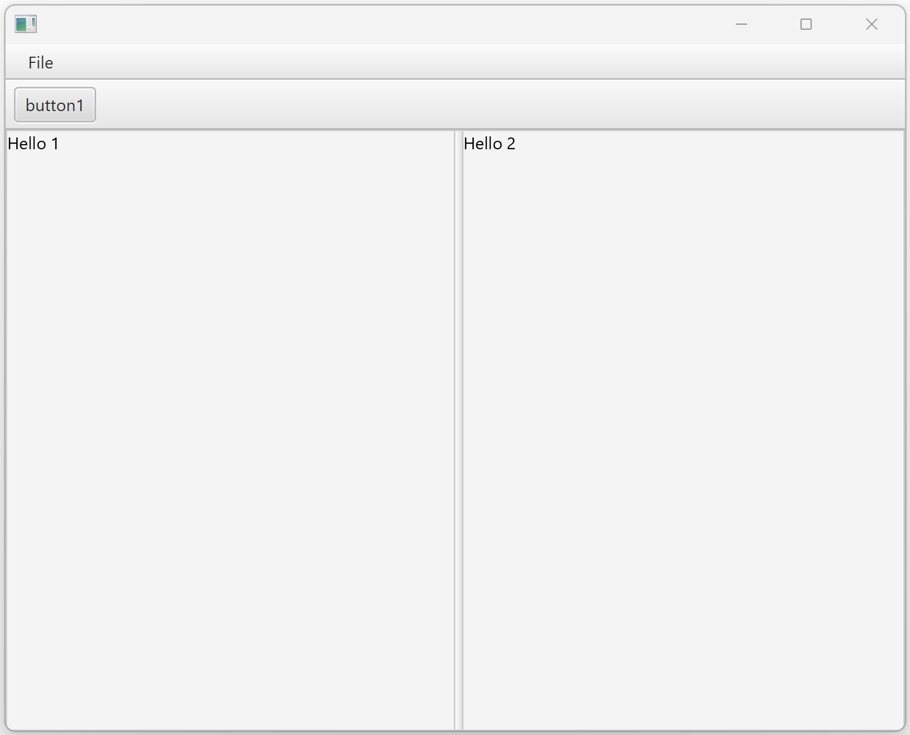

# A Minimalist javafx white App




it contains:

javafx dependency in maven pom.xml, mainly: 

```
<dependency>
  <groupId>org.openjfx</groupId>
  <artifactId>javafx-controls</artifactId>
  <version>${javafx.version}</version>
</dependency>
```

a java Main to run :

```
import fr.an.tests.javafxwhiteapp.ui.SimpleApp;
import javafx.application.Application;

public class SimpleAppMain {
	public static void main(String[] args) {
		Application.launch(SimpleApp.class, args);
	}
}
```

a javafx Application with 

```
 MenuBar 
   -> "File" Menu 
     -> "Open" MenuItem
     -> "Save" MenuItem
 Toolbar
   -> a Button
 a SplitPane
   -> View1 on left 
   -> View2 on right
```

See code:
```
import javafx.application.Application;
import javafx.stage.Stage;
import javafx.scene.Scene;
import javafx.scene.control.*;
..

public class SimpleApp extends Application {

    @Override
    public void start(Stage stage) {
    	BorderPane mainBorderPanel = new BorderPane();
    	
    	VBox menuAndToolbar = new VBox();
    	{ // MenuBar with "File" menu
            MenuBar mb = new MenuBar();
            menuAndToolbar.getChildren().add(mb);

            Menu fileMenu = new Menu("File");
            mb.getMenus().add(fileMenu);
            MenuItem openMenuItem = new MenuItem("Open");
            fileMenu.getItems().add(openMenuItem);
            MenuItem saveMenuItem = new MenuItem("Save");
            fileMenu.getItems().add(saveMenuItem);
    	}
    	
    	{ // button Toolbar
	    	ToolBar toolBar = new ToolBar();
	    	menuAndToolbar.getChildren().add(toolBar);
    		
	    	Button button1 = new Button("button1");
	    	toolBar.getItems().add(button1);
    	}
    	mainBorderPanel.setTop(menuAndToolbar);

    	{ // SplitPane( view1 | view2 )
	    	VBox view1 = new VBox();
	    	view1.getChildren().add(new Text("Hello 1"));
	
	    	VBox view2 = new VBox();
			view2.getChildren().add(new Text("Hello 2"));
	 
			SplitPane splitViewPane = new SplitPane(view1, view2);
			mainBorderPanel.setCenter(splitViewPane);
    	}
    	
		Scene scene = new Scene(mainBorderPanel, 640, 480);
        stage.setScene(scene);
        stage.show();
    }

}
```

